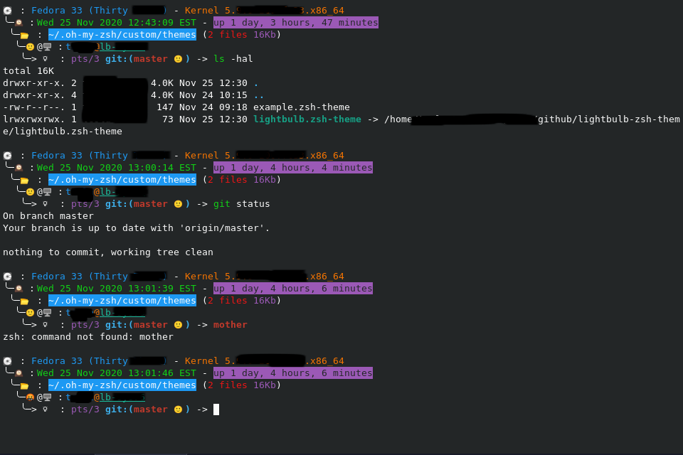

# lightbulb.zsh-theme

A ZSH theme that displays the following:

- 💽: OS - Kernel Information[ - **\*\*\*REBOOT REQUESTED\*\*\***]
- ╰─🕰: Datetime - **Uptime**
- ╰──📂: **Current directory** (Number of files and total size)
-  ╰───🙂|🤬@🖥: Job status(Good|Bad) username@<ins>hostname</ins>
-  ╰────>💡: TTY **git:(status)** ->

## Sample Screenshot
A redacted example looks like this (**Job Status** changes and **\*\*\*REBOOT REQUESTED\*\*\*** are circled):

## New feature - Reboot Notification!!

This will now let you know if you open a terminal that a reboot is requested.
  This is only checked on first launch of the terminal.
  The reboot check function for CentOS/Fedora depends on `yum-utils` or `dnf-utils`.
  Ubuntu checks for `/var/run/reboot-required`.

## Worth mentioning

I'm new to ZSH and only started using it because [Kali Linux](https://www.kali.org/news/kali-linux-2020-3-release/) decided to go that route and I wanted to see what all the hubbub was about.
  I set up this theme based on how I had my bash prompt set up.
  I've tested on Fedora and CentOS which is what I mainly use.
  Ubuntu seems to work as well although it is not as extensively tested.

Enjoy 🙂 (or not 🤬)!! 💡
