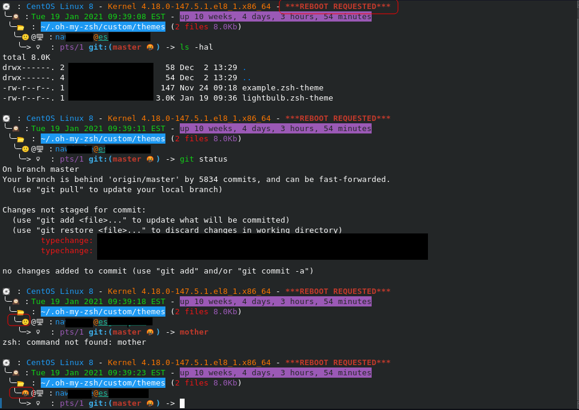

# lightbulb-zsh-theme
ZSH theme that displays the following:

- 💽: OS - Kernel Information
- ╰─🕰: Datetime - **Uptime**
- ╰──📂: **Current directory** (Number of files and total size)
-  ╰───🙂|🤬@🖥: Job status(Good|Bad) username@<ins>hostname</ins>
-  ╰────>💡: TTY **git:(status)** ->

A redacted example looks like this:

## Worth mentioning

I'm new to ZSH and only started using it because [Kali Linux](https://www.kali.org/news/kali-linux-2020-3-release/) decided to go that route and I wanted to see what all the hubbub was about. I set up this theme based on how I had my bash prompt set up. I rarely use Mac so I don't know how it would look there and it took about a day and 3 hours of fiddling around to get this point. Enjoy 🙂!! (or not 🤬). 💡
